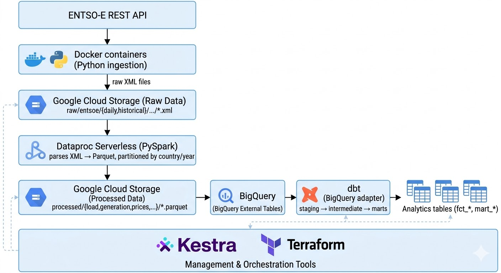

# ENTSO-E Data Engineering Pipeline

End-to-end data pipeline that ingests electricity data from the [ENTSO-E Transparency Platform](https://transparency.entsoe.eu/), processes it with Apache Spark, and transforms it into analytics-ready tables in BigQuery.

**Data collected:** hourly generation by technology, electricity demand (load), Day-Ahead Market prices, cross-border physical flows, and annual installed capacity — for all European countries.

## Why This Project

European power markets are highly interconnected and volatile. Raw ENTSO-E data is rich but fragmented across formats, domains, and time.

This project was built to:

- create a reproducible and automated pipeline from ingestion to analytics
- aggregate ENTSO-E data and make it easier to understand.
- collect and organize ENTSO-E data in a consistent way
- explore and visualize energy sources country by country across Europe
- analyze import and export flows between countries
- enable a clearer view of key patterns in the data without unnecessary complexity

In short, the idea is to turn fragmented raw data into something that can actually be explored, interpreted, and used.

Dashboard (Looker Studio):
<https://lookerstudio.google.com/reporting/d19dd5b5-034a-4618-b384-f41a29db9055>


> **Architecture Update:** The PySpark processing engine has recently been migrated from Dataproc Serverless to a **classic Dataproc Cluster**. This change was made to stay within the 12 vCPU limit(free trial account on GC) and to allow the use of a dedicated VM for Kestra, enabling fully automated daily ingestion and processing workflows. Please note that any previous references to Dataproc Serverless—including diagrams, images, or text in the README from earlier commits—should now be interpreted as referring to the classic Dataproc cluster. If you are interested in the original Dataproc Serverless implementation, you can find it in the Git history at commit 991538c.

---

## Dataset Architecture

The project separates storage into specialized BigQuery datasets:

- **`entsoe_warehouse`**: Bronze layer. Contains only external tables pointing to raw Parquet files on GCS. Managed by Terraform + `dbt run-operation stage_external_sources`.
- **`[target]_staging` & `_int`**: Silver layer. Dynamically created by dbt to hold intermediate and staging views.
- **`[target]` (e.g. `entsoe_analytics_dev`)**: Gold layer. Contains the final, optimized facts and dimensions (marts) ready for BI consumption. Managed by Terraform + dbt.

---

## Architecture



**Orchestration:** Kestra (self-hosted via Docker Compose)  
**Infrastructure provisioning:** Terraform

---

## dbt Transformation Layers

| Layer | Materialization | Purpose |
|---|---|---|
| `staging` | view | Type casting, deduplication, PSR code  |
| `intermediate` | view | Time dimensions, quality flags, capacity utilisation |
| `marts` | table | Daily aggregations (facts, dimensions, final marts) |

Key seeds: `psr_type_mapping.csv` (PSR code → technology name), `country_names.csv` (ISO-2 → full name + region).

Final mart tables `mart_country_energy_balance_daily` and `mart_country_price_load_daily` are the primary entry points for dashboards.

---

## Project Structure

```
.
├── Dockerfile               # Ingestion image (Python + uv)
├── Dockerfile.dbt           # dbt runner image (planned for automated post-daily runs)
├── pyproject.toml
├── .env.example             # template for api token
├── src/                     # Python ingestion scripts
│   ├── daily_ingestion.py
│   ├── historical_ingestion.py
│   ├── HistoricalPrice.py
│   ├── countries.json
│   └── borders.json
├── ScriptForSpark/          # PySpark jobs (submitted to Dataproc Cluster)
│   ├── entsoe_master_daily.py
│   ├── entsoe_master_historical.py
│   ├── entsoe_installed_capacity.py
│   └── entsoe_compact_load.py
├── dbt/                     # dbt project (BigQuery adapter)
│   ├── models/
│   │   ├── staging/
│   │   ├── intermediate/
│   │   └── marts/
│   ├── macros/
│   ├── seeds/
│   └── dbt_project.yml
├── kestra/                  # Kestra flow definitions and Docker Compose
│   ├── daily.yml
│   ├── historical.yml
│   ├── installed_capacity.yml
│   ├── dbt_daily.yml
│   ├── monthly_compaction.yml
│   ├── docker-compose.yml
│   ├── .env.example         # template for Kestra DB/auth credentials
│   └── .env_encoded.example # template for base64-encoded Kestra secrets
└── terraform/               # GCP infrastructure
    └── terraform.tfvars.example  # template for Terraform variables
```

### Two Dockerfiles

- **`Dockerfile`** — builds the Python ingestion image. Used by Kestra's `daily` and `historical` flows to download XML files from the ENTSO-E API and upload them to GCS. The image is pushed to **Google Artifact Registry** and pulled at runtime by Kestra.

- **`Dockerfile.dbt`** — builds a self-contained dbt runner image. Used for automated dbt execution as a Kestra task (`dbt_daily.yml`) 30 minutes after the daily Spark ingestion, keeping the transformation layer in sync without manual intervention. Also pushed to Artifact Registry.

---

## Reproduction

### Prerequisites

- Docker Desktop
- Terraform
- A Google Cloud project with billing enabled
- An ENTSO-E API token ([request here](https://transparency.entsoe.eu/))

---

### 1 — GCP Service Account

Create a service account with the following roles and download its JSON key to `terraform/credentials.json` (gitignored):

- `Storage Admin`
- `BigQuery Admin`
- `Artifact Registry Admin`
- `Service Usage Admin`
- `Compute Network Admin`
- `Dataproc Editor`

---

### 2 — Provision Infrastructure

```bash
cd terraform
```

Create `terraform.tfvars` (gitignored):

```hcl
```hcl
project_id              = "your-gcp-project-id"
region                  = "europe-west4"
zone                    = "europe-west4-a"
bucket_name             = "your-unique-bucket-name"
bq_raw_dataset_id       = "entsoe_warehouse"      
bq_analytics_dataset_id = "entsoe_analytics_dev"
```

```bash
terraform init
terraform apply
```

**Creates:** GCS bucket, 2 BigQuery datasets (warehouse for raw data, analytics for final models), Artifact Registry repository, VPC subnet, a classic Dataproc Cluster, Firewall rules, and a Compute Engine VM for Kestra.

> **⚠️ Cost Warning:** The Dataproc cluster and the Kestra VM are active after terraform apply, and they are compute resources that incur ongoing hourly costs. It is highly recommended to stop these resources when they are not actively being used to avoid unexpected charges.

---

### 3 — Build and Push Docker Images

```bash
gcloud auth configure-docker europe-west4-docker.pkg.dev

# Ingestion image
docker build -t europe-west4-docker.pkg.dev/<PROJECT_ID>/entsoe/ingest:latest .
docker push europe-west4-docker.pkg.dev/<PROJECT_ID>/entsoe/ingest:latest

# dbt image (optional, for automated runs)
docker build -f Dockerfile.dbt -t europe-west4-docker.pkg.dev/<PROJECT_ID>/entsoe/dbt:latest .
docker push europe-west4-docker.pkg.dev/<PROJECT_ID>/entsoe/dbt:latest
```

---

### 4 — Upload Spark Scripts to GCS

```bash
gsutil cp ScriptForSpark/*.py gs://<BUCKET_NAME>/scripts/
```

---

### 5 — Configure Kestra Secrets

Kestra reads secrets from base64-encoded environment variables prefixed with `SECRET_`.

```powershell
# PowerShell
$token = [Convert]::ToBase64String([System.Text.Encoding]::UTF8.GetBytes("your-entsoe-token"))
"SECRET_ENTSOE_TOKEN=$token" | Add-Content kestra/.env_encoded

$json = Get-Content -Raw terraform/credentials.json
$encoded = [Convert]::ToBase64String([System.Text.Encoding]::UTF8.GetBytes($json))
"SECRET_GCP_CREDS_JSON=$encoded" | Add-Content kestra/.env_encoded
```

---

### 6 — Start Kestra

You have two options for running Kestra:

1. **Google Cloud VM (Automated):** Terraform provisions a dedicated VM for Kestra. You can SSH into this VM, install Docker, and run Kestra there so it can automatically execute pipelines.
2. **Local Environment:** You can run Kestra locally using Docker Compose (note that Terraform will still provision the GCP VM).

For detailed setup instructions for both options, please refer to the [Kestra README](kestra/README.md).

If running locally:

```bash
cd kestra
docker compose up -d
```

Kestra UI: [http://localhost:8080](http://localhost:8080)

In any case (local or on the VM), you need to deploy the flows manually.

**Deploy the flows** — flows are not loaded automatically. For each file in `kestra/*.yml`:

1. Open **Flows** → **Create** in the Kestra UI
2. Paste the full contents of the YAML file and click **Save**

Flows to deploy:

- `kestra/daily.yml` — scheduled daily ingestion (runs automatically at 03:00 Europe/Rome)
- `kestra/historical.yml` — manual backfill trigger (requires `start_date` and `end_date` inputs)
- `kestra/installed_capacity.yml` — run once per year for capacity updates
- `kestra/monthly_compaction.yml` — scheduled monthly Parquet compaction
- `kestra/dbt_daily.yml` — scheduled dbt transformations pipeline (runs automatically at 03:30 Europe/Rome)

See [`kestra/README.md`](kestra/README.md) for a description of each flow.

---

### 7 — Run dbt

```bash
cd dbt

# First, run this to create the external tables in BigQuery
uv run dbt run-operation stage_external_sources

# Load seed reference tables
uv run dbt seed

# Run all models (first time or after schema changes)
uv run dbt run --full-refresh

# Run tests
uv run dbt test

# Generate documentation
uv run dbt docs generate
```

---

## Known Issue: Kestra + Dataproc serverless

- On long Spark jobs (typically historical backfills), Kestra may time out and report the task as `FAILED`, while Dataproc continues and completes successfully. The processed Parquet files on GCS are the source of truth — if they exist and are complete, the pipeline succeeded regardless of the Kestra task state. Check the logs of the Dataproc batch for more details.

- On a free trial on Google Cloud, the Dataproc provisioning can occasionally fail because Google might not have enough resources in that specific zone to fulfill the request. Try a different zone, or try again later (this usually works).

- (Fingers crossed I didn’t miss anything)

---

## CI/CD

A GitHub Actions workflow (`.github/workflows/deploy.yml`) automatically builds and pushes Docker images to Artifact Registry on every push to `main`.

It uses **path-based change detection** to avoid unnecessary builds:

| Changed paths | Action |
|---|---|
| `Dockerfile`, `src/**`, `ScriptForSpark/**`, `kestra/**` | Build & push `ingest:latest` + sync Spark scripts to GCS |
| `Dockerfile.dbt`, `dbt/**` | Build & push `dbt:latest` |

Required GitHub repository secrets: `GCP_PROJECT_ID`, `GCP_SA_KEY`, `GCS_BUCKET`.

---

## Further Documentation

Each major component has its own README with additional detail:

- `src/` — ingestion scripts, API usage, and country/border configuration
- `ScriptForSpark/` — Spark job internals, XML parsing logic, and partitioning strategy
- `dbt/` — dbt model structure, seed files, and macro documentation (also available via `uv run dbt docs generate`)
- `kestra/` — flow descriptions, secret configuration, and Docker Compose setup
- `terraform/` — infrastructure overview and variable reference
