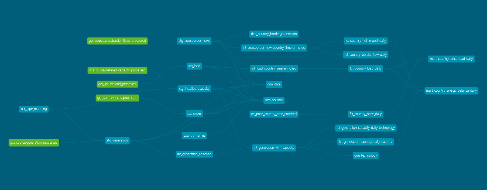

# dbt — Transformation Layer

This dbt project transforms raw ENTSO-E Parquet files (read via BigQuery External Tables) into analytics-ready tables in BigQuery. It uses the `dbt-bigquery` adapter.

## Running dbt

```bash
# Load seed reference tables (run once, or when seeds change)
uv run dbt seed

# Build all models
uv run dbt run

# First run or after structural changes (drops and recreates tables)
uv run dbt run --full-refresh

# Run data quality tests
uv run dbt test

# Generate HTML documentation
uv run dbt docs generate
```

## Model Layers & Custom Schemas

This project implements a Medallion architecture. While the default target dataset (e.g., `entsoe_analytics_dev`) holds the final models, dbt dynamically creates suffixed datasets for earlier layers using a custom `generate_schema_name` macro.

### Staging (`models/staging/`) — materialized as **views** in `[target]_staging`

Direct reads from BigQuery External Tables backed by GCS Parquet files. Each model:

- Casts columns to correct types
- Deduplies using `ROW_NUMBER() OVER (PARTITION BY id ORDER BY timestamp DESC)`
- Joins with seed tables to resolve technical codes to readable names

| Model | Source data |
|---|---|
| `stg_generation` | Hourly generation by technology |
| `stg_load` | Hourly electricity demand |
| `stg_prices` | Hourly Day-Ahead Market prices |
| `stg_crossborder_flows` | Hourly physical import/export flows |
| `stg_installed_capacity` | Annual installed capacity by technology |

---

### Intermediate (`models/intermediate/`) — materialized as **views** in `[target]_int`

Enriches staging data without aggregating. Each model adds:

- Time dimensions: `month`, `hour`, `quarter`, `season`, `is_weekend`, `ds` (date)
- Data quality flags: `is_outlier`, `is_price_negative`, `is_flow_missing`, etc.

`int_generation_with_capacity` is the most complex: it joins hourly generation with annual capacity to compute utilisation ratios (`mw_normalized_pct`), with a plausibility filter that nulls out ratios when installed capacity is below 10 MW.

---

### Marts (`models/marts/`) — materialized as **incremental tables** in `[target]`

#### Dimensions

Reference tables used for filtering and joins in BI tools.

| Model | Description |
|---|---|
| `dim_country` | All observed country codes + full name + region (from seed) |
| `dim_date` | Calendar with year, month, quarter, season, is_weekend |
| `dim_technology` | Generation technologies with renewable classification |
| `dim_country_border_connection` | All observed country-border-direction combinations |

#### Facts (daily grain)

Aggregate hourly intermediate data into one row per country per day (or per country+technology per day).

| Model | Grain | Key metrics |
|---|---|---|
| `fct_country_load_daily` | country × day | sum, avg, peak, min demand |
| `fct_country_price_daily` | country × day | avg, peak, min price, stddev, negative ratio |
| `fct_country_net_import_daily` | country × day | import sum, export sum, net import |
| `fct_country_border_flow_daily` | country × border × direction × day | flow sum, avg, peak |
| `fct_generation_capacity_daily_country` | country × day | generation sum, capacity utilisation avg/peak |
| `fct_generation_capacity_daily_technology` | country × technology × day | generation and utilisation per technology |

#### Marts (final aggregations)

Top-level tables combining multiple facts into dashboard-ready KPIs.

| Model | Sources | Key KPIs |
|---|---|---|
| `mart_country_energy_balance_daily` | generation + load + net import | `self_sufficiency_ratio`, `import_dependency_ratio`, `residual_balance_mw` |
| `mart_country_price_load_daily` | prices + load | `price_regime`, `price_to_load_ratio` |

## Incremental Strategy

Fact and mart tables use `materialized='incremental'` with `merge` strategy. By default, each run processes only the last 3 days of data (configurable lookback window). 
However, when orchestrated by Kestra, dbt receives an explicit `execution_date` variable. Because Kestra's daily ingestion pipeline targets the previous day (`Trigger Date - 1 day`), Kestra automatically sets `execution_date` to `Trigger Date - 1 day` (your *data-1*). dbt then enforces a strict 2-day processing window encompassing `execution_date - 1` (*data-2*) and `execution_date` (*data-1*). This ensures perfect alignment with the newly ingested data while proactively healing late-arriving records. Use `--full-refresh` to reprocess the full history.

## Seeds

| File | Purpose |
|---|---|
| `psr_type_mapping.csv` | Maps ENTSO-E PSR codes (e.g. `B16`) to technology names (e.g. `Solar`) |
| `country_names.csv` | Maps ISO-2 country codes to full names and geographic regions |

## Macros

Reusable SQL logic shared across models:

- `safe_divide` — division protected against null/zero denominator
- `capacity_utilization_pct` — `100 * (mw / installed_capacity_mw)`
- `is_capacity_plausible` — true when capacity ≥ 10 MW
- `generation_is_renewable` — classifies technology names as renewable/non-renewable
- `time_dimension_columns` — generates month, hour, quarter, season, is_weekend from a timestamp
- `incremental_ds_filter` — filters to the last N days for incremental runs (local default) or to a strict date boundary when supplied an `execution_date` variable by Kestra.


